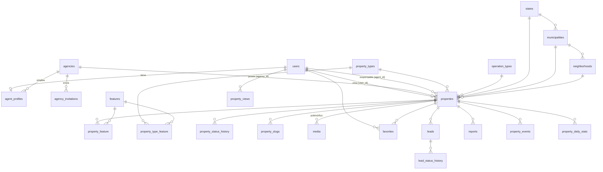

# Base de datos

> Estado: **PROPUESTA**. Motor: MySQL 8.0 (ADR-02). Convenciones: tablas en inglés plural snake_case, PK `id` BIGINT unsigned, FKs `{tabla_singular}_id` con `foreignId()->constrained()`, `timestamps()` en todas, `softDeletes()` donde se indica, dinero en `DECIMAL(14,2)`, coordenadas en `DECIMAL(10,7)`.

## 1. Cambios respecto a la lista del documento maestro
| Tabla sugerida | Decisión | Motivo |
|---|---|---|
| roles, permissions | Las crea spatie/laravel-permission (`roles`, `permissions`, `model_has_roles`, `model_has_permissions`, `role_has_permissions`) | ADR-06 |
| property_images | Reemplazada por `media` (spatie/medialibrary) | ADR-07; soporta orden, principal (custom property), conversiones y futuros videos/planos |
| property_features + features | `features` (catálogo) + pivote `property_feature` | Nombre convencional de pivote Laravel |
| locations | **No se crea** | Redundante: la jerarquía es states → municipalities → neighborhoods y la dirección vive en `properties` |
| cities | Se llama `municipalities` | Q-07/Q-08 |
| agents | Se llama `agent_profiles` (1:1 con users) | El agente es un `user` con rol `agent`; el perfil guarda datos profesionales |
| notifications | Tabla nativa de Laravel | — |
| conversations, messages | Se crean en Fase 10 (post-MVP) | Q-19 |
| **Nuevas** | `property_type_feature`, `property_status_history`, `property_slugs`, `lead_status_history`, `agency_invitations`, `property_views`, `property_events`, `property_daily_stats`, `saved_searches` (post-MVP), `exchange_rates`, `settings`, `activity_log` | Justificadas abajo |

## 2. Diagrama entidad-relación (MVP)

## 3. Tablas

### 3.1 Identidad
**users** — `id`, `name`, `email` (unique), `email_verified_at`, `password`, `phone` null, `whatsapp` null, `avatar_path` null, `is_blocked` bool default false, `blocked_reason` null, `last_login_at` null, `remember_token`, timestamps, softDeletes.
Índices: `email` unique.

**agent_profiles** — `id`, `user_id` FK unique cascade, `agency_id` FK null nullOnDelete, `slug` unique, `license_number` null, `bio` text null, `public_phone`, `public_whatsapp`, `public_email`, `website` null, `social_links` JSON null, `is_verified` bool, `verified_at` null, timestamps.
Índices: `agency_id`, `is_verified`.

**agencies** — `id`, `name`, `slug` unique, `legal_name` null, `rfc` null, `description` text null, `logo_path` null, `phone`, `whatsapp`, `email`, `website`, `address`, `state_id` FK null, `municipality_id` FK null, `is_verified` bool, timestamps, softDeletes.
Los administradores de la inmobiliaria se relacionan vía **agency_user** (`agency_id`, `user_id`, `role` enum[`owner`,`admin`]) — permite más de un admin.

**agency_invitations** — `id`, `agency_id` FK cascade, `email`, `token` unique, `invited_by` FK users, `accepted_at` null, `expires_at`, timestamps.

### 3.2 Catálogos
**operation_types** — `id`, `name` (Venta), `slug` unique (venta), `price_periods` JSON (permitidos), `closing_status` enum[`sold`,`rented`], `sort_order`, `is_active`, timestamps.
Semilla: venta, renta, preventa, traspaso, temporal.

**property_types** — `id`, `name`, `slug` unique, `plural_slug` (casas) para SEO, `icon` null, `applicable_fields` JSON (ej. `["bedrooms","bathrooms","built_area"]`), `sort_order`, `is_active`, timestamps.
Semilla: los 16 tipos del documento.

**features** — `id`, `name`, `slug` unique, `group` (amenidades, seguridad, exteriores, servicios…), `type` enum[`boolean`,`number`,`text`] default boolean, `is_filterable` bool, `icon` null, `sort_order`, `is_active`, timestamps.
Semilla: amueblada, mascotas, alberca, jardín, terraza, balcón, roof garden, seguridad 24h, elevador, gimnasio, áreas comunes, etc.
> `furnished` y `pets_allowed` además son columnas en `properties` porque son filtros de primer nivel (sección 8).

**property_type_feature** — `property_type_id`, `feature_id` (PK compuesta). Define qué características aplican a cada tipo (Q-11).

**states** — `id`, `country_code` char(2) default 'MX', `name`, `slug` unique, `inegi_code` unique, timestamps.
**municipalities** — `id`, `state_id` FK, `name`, `slug`, `inegi_code`, `latitude`, `longitude` null, timestamps. Unique `(state_id, slug)`.
**neighborhoods** — `id`, `municipality_id` FK, `name`, `slug`, `postal_code` char(5), `settlement_type` null, timestamps. Unique `(municipality_id, slug, postal_code)`; índice `postal_code`.

### 3.3 Propiedades
**properties**
| Columna | Tipo | Notas |
|---|---|---|
| id | bigint | |
| code | string(20) unique | BR-PROP-03 |
| slug | string unique | BR-PROP-04 |
| user_id | FK users | creador |
| agency_id | FK agencies null | Q-03 |
| agent_id | FK users null | agente responsable |
| property_type_id | FK | |
| operation_type_id | FK | |
| status | string(20) | Enum `PropertyStatus` |
| title | string(120) | |
| description | text | |
| price | decimal(14,2) | |
| currency | char(3) | MXN/USD |
| price_mxn | decimal(14,2) | Q-09 |
| previous_price | decimal(14,2) null | |
| price_period | string(10) | Q-10 |
| price_per_m2 | decimal(12,2) null | Q-21 |
| maintenance_fee | decimal(12,2) null | cuota de mantenimiento |
| total_area, built_area, land_area | decimal(10,2) null | m² |
| bedrooms, bathrooms, half_bathrooms, parking_spaces, floors | unsigned tinyint/smallint null | |
| year_built | smallint null | antigüedad = año actual − year_built |
| condition | string null | enum: nueva, excelente, buena, a remodelar |
| furnished | string null | enum: no, semi, sí |
| pets_allowed | bool null | |
| state_id, municipality_id | FK | obligatorios para publicar |
| neighborhood_id | FK null | |
| postal_code | char(5) null | |
| street, exterior_number, interior_number | string null | privados |
| address_references | string null | privado |
| latitude, longitude | decimal(10,7) null | privados |
| public_latitude, public_longitude | decimal(10,7) null | Q-16 |
| hide_exact_location | bool default true | |
| is_featured | bool default false | Q-15 |
| featured_until | timestamp null | |
| published_at, expires_at | timestamp null | |
| rejection_reason | text null | último motivo |
| meta_title, meta_description | string null | override SEO opcional |
| views_count, favorites_count, leads_count | unsigned int default 0 | contadores desnormalizados |
| timestamps, softDeletes | | |

Índices:
- `(status, operation_type_id, property_type_id, price_mxn)` — búsqueda principal
- `(status, state_id, municipality_id)`, `(status, neighborhood_id)`
- `(status, published_at)` — recientes
- `(status, public_latitude, public_longitude)` — mapa
- `(status, bedrooms)`, `(status, built_area)`
- `(agency_id, status)`, `(agent_id, status)`, `(user_id, status)` — paneles
- `(is_featured, featured_until)`

**property_feature** — `property_id` FK cascade, `feature_id` FK cascade, `value` string null (para features numéricas/texto). PK `(property_id, feature_id)`; índice `(feature_id, property_id)`.

**property_status_history** — `id`, `property_id` FK cascade, `from_status` null, `to_status`, `user_id` FK null (null = sistema), `reason` text null, `created_at`. Índice `(property_id, created_at)`.

**property_slugs** — `id`, `property_id` FK cascade, `slug` unique, `created_at`. Para redirecciones 301 (BR-PROP-04).

**media** — tabla de spatie/medialibrary (`model_type`, `model_id`, `collection_name` = `photos`, `order_column`, `custom_properties` {is_main}, `conversions_disk`, …).

### 3.4 Interacción
**favorites** — `id`, `user_id` FK cascade, `property_id` FK cascade, timestamps. Unique `(user_id, property_id)`.

**property_views** (historial del usuario) — `id`, `user_id` FK cascade, `property_id` FK cascade, `viewed_at`. Unique `(user_id, property_id)` (se actualiza `viewed_at`). Q-25.

**leads** — `id`, `property_id` FK, `agent_id` FK users null, `agency_id` FK null, `user_id` FK null (si estaba autenticado), `name`, `email` null, `phone` null, `whatsapp` null, `message` text, `status` string (Enum `LeadStatus`), `source` (form, whatsapp_click, phone_click), `ip_address`, `user_agent`, `consent_at`, `notes` text null, timestamps.
Índices: `(agent_id, status, created_at)`, `(agency_id, status)`, `(property_id)`.

**lead_status_history** — `id`, `lead_id` FK cascade, `from_status`, `to_status`, `user_id` FK, `note` null, `created_at`.

**reports** — `id`, `property_id` FK cascade, `user_id` FK null, `email` null, `reason` string (Enum `ReportReason`), `details` text null, `status` (Enum `ReportStatus`), `resolved_by` FK users null, `resolution_note` null, `resolved_at` null, timestamps. Unique `(property_id, user_id)` y `(property_id, email)`.

### 3.5 Analítica
**property_events** — `id`, `property_id` FK cascade, `type` (view, contact, phone_click, whatsapp_click, favorite, share), `user_id` null, `session_hash` char(64), `ip_hash`, `created_at`. Índice `(property_id, type, created_at)`. Purga > 90 días.
**property_daily_stats** — `property_id`, `date`, `views`, `contacts`, `phone_clicks`, `whatsapp_clicks`, `favorites`, `shares`. PK `(property_id, date)`. Agregado por job diario.

### 3.6 Plataforma
**exchange_rates** — `id`, `currency` char(3), `rate_to_mxn` decimal(12,6), `effective_at`, timestamps.
**settings** — `key` unique, `value` JSON (límites, máximos de fotos, etc.).
**activity_log** — spatie/activitylog (auditoría admin).
**notifications**, **jobs**, **failed_jobs**, **cache**, **sessions**, **password_reset_tokens**, **personal_access_tokens** — nativas de Laravel/Sanctum.

### 3.7 Post-MVP
**conversations** — `id`, `property_id` FK null, `lead_id` FK null, timestamps. **conversation_participants** — `conversation_id`, `user_id`, `last_read_at`. **messages** — `id`, `conversation_id` FK, `user_id` FK, `body` text, timestamps (adjuntos vía medialibrary).
**saved_searches** — `id`, `user_id` FK, `name`, `criteria` JSON, `frequency` (instant, daily, weekly), `last_notified_at`, timestamps.

## 4. Seeders
| Seeder | Ambiente | Contenido |
|---|---|---|
| RolesAndPermissionsSeeder | todos | roles y permisos (authorization.md) |
| OperationTypeSeeder, PropertyTypeSeeder, FeatureSeeder | todos | catálogos base |
| LocationSeeder (comando `locations:import`) | todos | estados/municipios INEGI + colonias SEPOMEX desde CSV |
| AdminUserSeeder | todos | super admin desde `.env` (`ADMIN_EMAIL`, `ADMIN_PASSWORD`) |
| DemoSeeder | local/staging | usuarios, agencias, agentes, 500 propiedades con fotos de ejemplo, leads, favoritos |

## 5. Factories
Una por modelo con *states* útiles: `PropertyFactory::published()`, `->draft()`, `->forAgency($agency)`, `->withPhotos(3)`, `UserFactory::agent()`, `->admin()`, `->blocked()`, `LeadFactory::new()`, etc.
